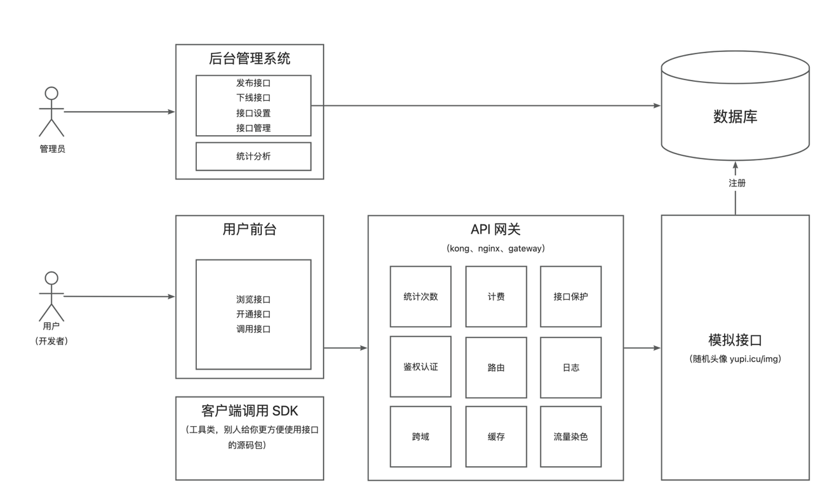

# API 开放平台

> **GitHub 项目地址**
>
> [前端](https://github.com/codehev/api-frontend) | [后端](https://github.com/codehev/api-backend) 


## 项目介绍

API开放平台是一个提供API接口调用服务的完整解决方案，基于Spring Boot后端 + React前端的**全栈微服务项目**。该平台旨在为开发者提供一站式的API服务，简化API的接入、调用和管理流程。

本项目采用前后端分离架构，前端基于React 18和Ant Design Pro构建现代化UI界面，后端使用Spring Boot框架提供稳定高效的服务支持。通过微服务架构设计，实现了系统的高可用性、可扩展性和维护性。

管理员可以接入并发布接口、统计分析各接口调用情况；用户可以注册登录并开通接口调用权限、浏览接口、在线调试，还能使用**客户端SDK**轻松在代码中调用接口。

## 核心功能

### 用户端功能

- 🔐 **账户管理**：用户注册、登录、个人信息管理
- 📚 **接口市场**：浏览可用API接口列表，查看接口详情
- 🔑 **密钥管理**：生成、查看和重置API调用密钥
- ⚡ **在线调试**：在平台上实时测试API功能
- 📊 **调用统计**：查看个人API调用频率和统计数据
- 💻 **SDK下载**：下载对应编程语言的客户端SDK

### 管理端功能

- 👥 **用户管理**：查看、封禁、解封用户
- 🔌 **接口管理**：创建、发布、下线、删除API接口
- 📈 **数据分析**：分析平台接口调用情况、用户增长趋势
- 🔍 **日志审计**：查看系统操作日志，追踪异常情况
- 🛠️ **系统配置**：管理系统全局配置参数

## 项目特点

- 🚀 基于React 18和Ant Design Pro 5.x构建的现代化前端界面
- 🔑 完整的用户登录、注册和鉴权系统
- 📊 接口调用情况数据可视化展示
- 🔌 在线调试接口功能
- 💼 管理员接口管理与数据分析功能
- 🔄 微服务架构，支持横向扩展
- 🛡️ API签名认证，保障调用安全
- 📦 提供多语言SDK，降低接入门槛
- 🌐 Gateway网关统一请求入口
- 📝 自动生成API文档

## 技术栈

### 前端技术

- **核心框架**：React 18
- **UI组件库**：Ant Design 4.x & Procomponents
- **开发框架**：Umi 4
- **状态管理**：@umijs/max
- **请求处理**：Axios、Umi Request
- **代码规范**：ESLint、Prettier
- **数据可视化**：ECharts
- **开发工具**：TypeScript、Less

### 后端技术

- **核心框架**：Spring Boot 2.7.x
- **数据存储**：MySQL 8.0
- **ORM框架**：MyBatis-Plus
- **微服务**：
  - Dubbo 3.0（RPC框架）
  - Nacos（服务注册与配置）
  - Spring Cloud Gateway（API网关）
- **文档工具**：Swagger、Knife4j
- **工具库**：
  - Hutool（工具集）
  - Apache Commons
  - Gson（JSON处理）
- **SDK开发**：Spring Boot Starter

## 项目架构

项目采用经典的微服务架构，主要包含以下几个部分：

1. **网关层**：统一接入层，负责请求转发、鉴权、限流等
2. **业务层**：核心业务逻辑的实现
3. **SDK层**：提供给开发者的接口调用SDK
4. **存储层**：数据持久化服务

详细的系统架构如下图所示：



## 快速开始

### 环境要求

- **Node.js** 12.0+
- **npm** 6.0+ 或 **yarn** 1.20+
- **Git**

### 安装与运行

1. **克隆项目**
   ```bash
   git clone https://github.com/codehev/api-frontend.git
   cd api-frontend
   ```

2. **安装依赖**
   ```bash
   npm install
   # 或
   yarn
   ```

3. **启动开发服务器**
   ```bash
   npm run start
   # 或
   yarn start
   ```
   开发服务器默认运行在 http://localhost:8000

4. **构建生产版本**
   ```bash
   npm run build
   # 或
   yarn build
   ```
   构建后的文件将生成在 `dist` 目录中

### 配置开发环境

1. **环境变量配置**

   在项目根目录创建 `.env` 文件，配置以下环境变量：

   ```
   UMI_ENV=dev
   REACT_APP_ENV=dev
   ```

2. **代理配置**

   如需连接到后端服务，可以修改 `config/proxy.ts` 文件：

   ```ts
   dev: {
     '/api/': {
       target: 'http://localhost:8101',
       changeOrigin: true,
       pathRewrite: { '^': '' },
     },
   }
   ```

## 项目结构

```
api-frontend/
├── config/                # UMI配置文件
├── mock/                  # 模拟数据
├── public/                # 静态资源
├── src/
│   ├── components/        # 通用组件
│   │   ├── Admin/         # 管理员页面
│   │   ├── Index/         # 首页
│   │   ├── InterfaceInfo/ # 接口详情页
│   │   └── User/          # 用户相关页面
│   ├── services/          # 后端服务接口
│   │   └── api-backend/ # API接口定义
│   ├── app.tsx            # 应用入口
│   ├── global.less        # 全局样式
│   └── requestConfig.ts   # 请求配置
├── .editorconfig          # 编辑器配置
├── .eslintrc.js           # ESLint配置
├── .prettierrc.js         # Prettier配置
├── package.json           # 项目依赖
└── tsconfig.json          # TypeScript配置
```

## 开发指南

### 新增页面

1. 在 `src/pages` 目录下创建新的页面目录和组件
2. 配置路由：修改 `config/routes.ts` 文件，添加新的路由配置

### 新增API接口

1. 接口定义自动生成：
   ```bash
   npm run openapi
   # 或
   yarn openapi
   ```
   
2. 手动添加接口：在 `src/services` 目录下创建服务文件

### 编码规范

- 遵循TypeScript的类型定义规范
- 组件使用函数式组件，并使用React Hooks管理状态
- 尽量使用Ant Design提供的组件库
- 代码提交前运行lint检查：
  ```bash
  npm run lint
  # 或
  yarn lint
  ```

## 部署指南

### 构建生产版本

```bash
npm run build
# 或
yarn build
```

### Nginx配置示例

```nginx
server {
    listen 80;
    server_name api-platform.example.com;
    
    location / {
        root /path/to/api-frontend/dist;
        index index.html index.htm;
        try_files $uri $uri/ /index.html;
    }
    
    location /api/ {
        proxy_pass http://backend-server:8101/api/;
        proxy_set_header Host $host;
        proxy_set_header X-Real-IP $remote_addr;
    }
}
```

### 使用Docker部署

1. **构建Docker镜像**

   ```bash
   docker build -t api-frontend .
   ```

2. **运行容器**

   ```bash
   docker run -d -p 80:80 --name api-platform api-frontend
   ```

## 接口文档

开发环境下访问：http://localhost:8000/umi/plugin/openapi

## 贡献指南

欢迎参与项目贡献！请遵循以下步骤：

1. Fork 本仓库
2. 创建新的特性分支 (`git checkout -b feature/amazing-feature`)
3. 提交你的改动 (`git commit -m 'Add some amazing feature'`)
4. 推送到远程分支 (`git push origin feature/amazing-feature`)
5. 创建Pull Request

### 提交规范

commit消息格式：

```
<type>(<scope>): <subject>
```

常用type：
- feat: 新功能
- fix: 修复bug
- docs: 文档更新
- style: 代码格式修改
- refactor: 重构
- test: 测试用例
- chore: 其他修改

## 常见问题

### Q: 如何解决本地开发时接口调用跨域问题？
A: 修改 `config/proxy.ts` 文件配置代理服务器。

### Q: 如何修改API的基础URL？
A: 在 `src/requestConfig.ts` 文件中修改baseURL配置。

### Q: 前端如何处理用户认证？
A: 系统使用token认证机制，登录成功后将token存储在localStorage中，并在每次请求时添加到请求头。

## 许可证

本项目采用 [MIT 许可证](LICENSE)。

## 联系方式

如有任何问题或建议，请通过以下方式联系我们：

- GitHub Issues: [https://github.com/codehev/api-frontend/issues](https://github.com/codehev/api-frontend/issues)
- Email: [codehev@qq.com](mailto:codehev@qq.com)

---

感谢使用API开放平台！
